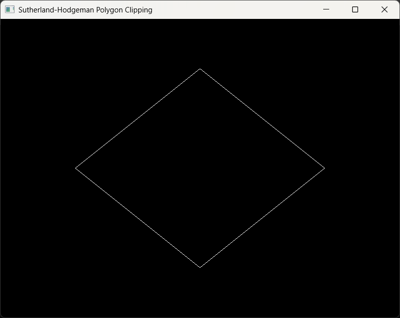
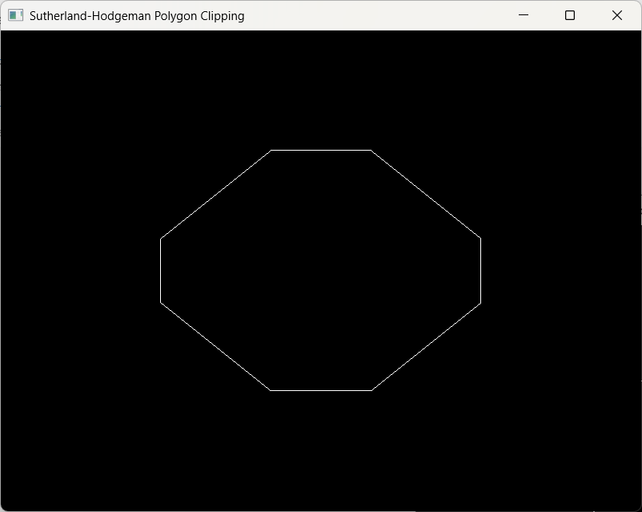

# Sutherland–Hodgman Polygon Clipping

https://dl.acm.org/doi/10.1145/360767.360802

This project is a modern OpenGL demo of the **Sutherland–Hodgman polygon clipping algorithm**.  
It shows how to clip a polygon against a rectangular viewport and render both the **original polygon** and the **clipped result** interactively.

Unclipped                  |  Clipped
:-------------------------:|:-------------------------:
            | 


---

# How it works:
Note: This is an abridged version of how Newell and Sproul explain it in their textbook Principles of Interactive Computer Graphics.

It would be really annoying to have to divide polygons into line segments to be able to clip them, so Sutherland and Hodgeman solved that issue in the paper linked above.
They used the idea that clipping a polygon against a single edge is pretty easy, and created an algorithm that "simply" did this in turn for each edge, testing each vertex against each clipping edge.
Maybe that sounds slow at first, but it really isn't. We still use this algorithm today because of it's simplicity and elegance.

A recursive solution is also possible, and is recommended by Newell and Sproul because of how much it improves the space required to perform the algorithm. This is not much of an issue nowadays, but it's still a very important issue. An **interative** solution is what is included in this program. If you would like to try your hand at a recursive solution, it would look something like this:

```
std::vector<Vertex> clipRecursive(
    const std::vector<Vertex>& poly,
    int boundary,
    float xmin, float ymin, float xmax, float ymax)
{
    if (boundary == 4) {
        // Base case: all 4 boundaries processed
        return poly;
    }

    // Clip against this boundary
    std::vector<Vertex> clipped = clipAgainstBoundary(poly, boundary, xmin, ymin, xmax, ymax);

    // Recurse to the next boundary
    return clipRecursive(clipped, boundary + 1, xmin, ymin, xmax, ymax);
}
```

# Features
- Implementation of the Sutherland–Hodgman polygon clipping algorithm in C++  
- Real-time rendering using GLFW + GLAD  
- Toggle between the original polygon and clipped polygon (use the `C` key)  
- Resize-aware: polygons are mapped to Normalized Device Coordinates automatically  
- Minimal vertex & fragment shaders
